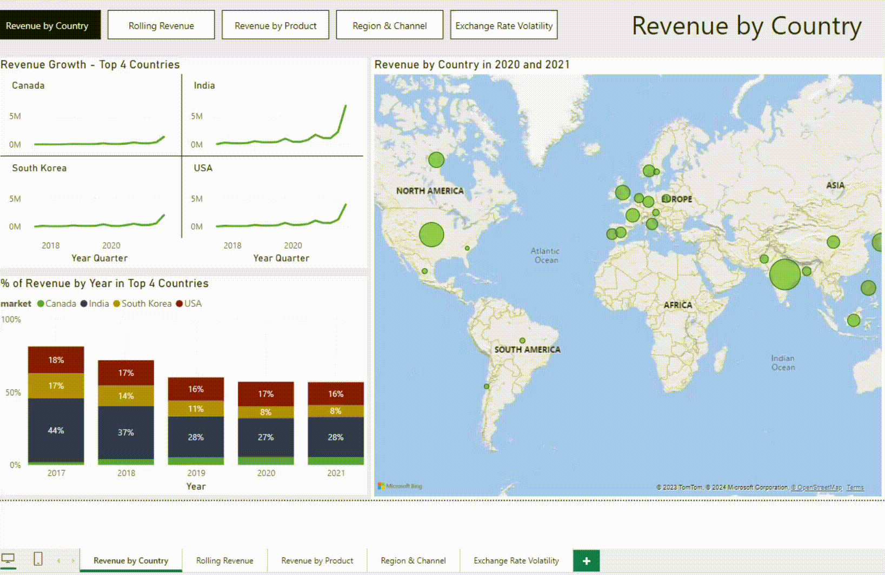

# Hardware Products Analysis

## Table of contents

- [Hardware Products Analysis](#hardware-products-analysis)
  - [Table of contents](#table-of-contents)
  - [Source](#source)
  - [Explore](#explore)
  - [Business problem](#business-problem)
  - [Tech stack](#tech-stack)
  - [Agenda](#agenda)
    - [Revenue by Country](#revenue-by-country)
    - [Rolling Revenue](#rolling-revenue)
    - [Revenue by Product](#revenue-by-product)
    - [Region \& Channel](#region--channel)
    - [Exchange Rate Volatility](#exchange-rate-volatility)
  - [Page Navigation](#page-navigation)

## Source

This PowerBI report presents sales of Atliq Hardware products. The data comes from [Kaggle](www.kaggle.com), from which it was downloaded into an MS Excel spreadsheet. The tables are named *Customer, Gross Price, Manufacturing Cost, Pre Discount, Product and Sales Monthly*.

## Explore

To view the report, download the *.pbix* file along with the Excel file. If the report shows **error**, then you probably have to change the *absolute path* of priorly downloaded Excel source file. To do this, go to **Power Query** &rarr; **File** &rarr; **Data source settings**.

## Business problem

There is a need for a robust revenue analysis system that can integrate data from various sources, including sales figures and market research. The goal is to develop a comprehensive understanding of the revenue landscape, enabling the company to make data-driven decisions for product development, marketing, and overall business strategy. Implementing a sophisticated analytics solution will empower the business to identify growth opportunities, mitigate risks, and enhance overall competitiveness in the hardware products market.

## Tech stack

- Microsoft Power BI & DAX
- Python (fetching exchange rates from API)

## Agenda
1. Revenue by Country
2. Rolling Revenue
3. Revenue By Product
4. Region & Channel
5. Exchange Rate Volatility

The report consists of five pages, each dealing with a different aspect.

### Revenue by Country

The first page, called *Revenue by Country*, analyses the sales revenue trend in the four highest revenue-generating countries. It can be seen that significant revenue growth over time has occurred in India and the USA in recent years. However, the stacked column chart showed that the share of these countries is declining, so the share of other countries in sales is increasing. In addition, an auxiliary map was created showing the aggregate revenue in countries in the last two years.

### Rolling Revenue

*Rolling Revenue* page shows the trend in revenue over time. To make the trend lines smoother, an average windowed revenue was calculated. For comparison, the rolling revenue in a given year and the rolling revenue of the previous year are juxtaposed. To better illustrate revenue growth, an auxiliary line has been added to show the percentage increase in rolling revenue compared to last year - the percentages are on the secondary right-hand axis.

### Revenue by Product

This page illustrates the amount of revenue by products over time. In the beginning, the company was selling only two products, which were generating about the same amount of revenue. This was followed by a new product, the *AQ WereWolf NAS Internal Hard Drive HDD*, which revenue share increased significantly in 2018-2019 at the expense of the *AQ Mforce Gen X*. The last product introduced, AQ Zion Saga, was also a revenue success, as evidenced by, for e.g., last quarter.

### Region & Channel

This page analyses revenue by platform, distribution channel and region. The chart on the left suggests that the biggest revenue contributors are, in the following order:
1. Platform
2. Distribution channel
3. region

A supporting map has been created next to it to get a better look at the revenue generated in different countries by distribution channel.

### Exchange Rate Volatility

The last page analyses currency risk in the two largest foreign markets relative to revenue - the US and South Korea. Exchange rate data for the day was downloaded from the National Bank of Poland's [API](https://api.nbp.pl/) using a Python script (*forex*). 

The table in the top left corner shows the exchange rate volatility on an annual basis. Below this, an auxiliary chart was created comparing revenue in the company's home currency (Indian rupee) with revenue in a foreign currency - for convenience, two buttons were created in the top right corner to help quickly flip between the two exchange rates.

## Page Navigation

To easily navigate between the pages of the report, a group of buttons has been created and is available on each page in the top left corner next to the page title.
